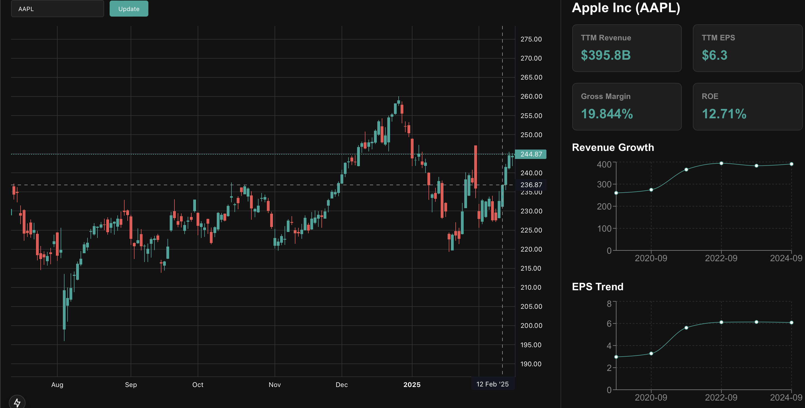

## Goal
**The goal of this assignment is to improve the fundamental analysis provided by this sample app**. The challenge with fundamental analysis using the least amount of space (chart / data) to present information that would be useful in making a trading / investing decision. This is a realistic representation of projects for the **Full Stack developer / Product Owner** position. 

The right panel is a placeholder so please feel free to modify it as you see fit. You are not expected to use all (or most) of the data provided. **There should be no more than 2 charts and 4 numbers / data points on the right panel**. Simplicity is key here. In fact the less you can include and still be useful the better.

**P.S.: The expectation is that this should take a few hours (no more than 3 to 4 hours)**

## Submission
The preferred way is to submit a PR to this repo and optionally you can also email us your CV with your github username on it. 

If you are uncomfortable with a public PR, you can also submit a zip file of your changes.

**team(at)tradevision(dot)com**

## Setup
- Clone the repo by running: `git clone https://github.com/tradevisionio/mini-project.git.git`
- Unzip the data file `public/data/processed.zip`. It should unzip into a `public/data/processed` folder and should contain multiple `{symbol}.json` (e.g. `AAPL.json`) files.
- Install dependencies by running: `yarn`
- Run the app by running: `yarn dev`
- Visit `http://localhost:3000` in your browser to see the app.

## Data Notes
- Not all symbols are available. Only some tickers in the Technology sector are available.
- `annual_XXX` and `q_XXX` are list of values for yearly and quarterly data respectively.
- `XXXX_growth_5y` and `XXXX_growth_3y` are the 5 year and 3 year growth rates in % for the given metric. For example, `eps_growth_5y = 1.73` means that the EPS has grown by 1.73% per year for the past 5 years.
- `ttm_XXX` is the trailing 12 month value for the given metric. For example, `ttm_eps = 0.5` means that the EPS for the past 12 months is $0.5.